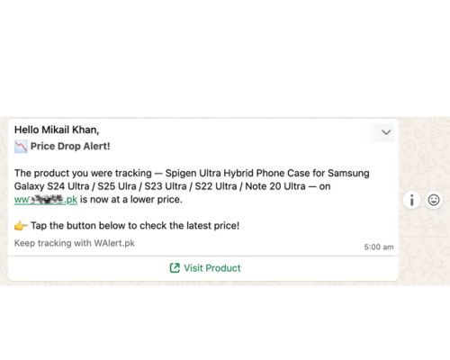

# walertpublic

Get price drop alerts on your whatsapp for any ecommerce website.

## Table of contents

- [Project](#project)
- [Features](#features)
- [Demo](#Demo)
- [Tech stack](#tech-stack)
- [Requirements](#requirements)
- [Quickstart](#quickstart)
- [Configuration](#configuration)
- [Usage](#usage)
- [Development](#development)
- [License](#license)
- [Contact](#contact)
- [Acknowledgements](#acknowledgements)

## Project

> WAlert is a lightweight alerting and notification service that delivers alerts via whatsapp. This repository contains the public frontend and API for demonstration and integration.

## Demo

- Get a product link
  
- Send it to the whatsapp bot
  
- Your tracker will be placed
  
- Example of price drop alert after price goes down
  
- Menu
  
  

## Features

- Alert creation, and delivery
- Channel: Whatsapp
- Web UI for managing alerts (if applicable)
- Lightweight API for integrations
- Authentication and role-based access (if applicable)

## Tech stack

List the primary technologies used. Replace with actual stack.

- Language: Javascript (TypeScript) / Node.js
- Web framework: Express.js
- Database: PostgreSQL (with Drizzle ORM)
- Frontend: React.js

## Requirements

Install these before running locally:

- Git
- Node.js >= 18
- npm
- Database server (Postgres)

## Quickstart (local)

1. Clone the repository:

```bash
git clone https://github.com/mikailkhan/walertpublic.git
cd walertpublic
```

2. Install dependencies (Node example):

```bash
npm i
```

3. Create environment file:

```bash
touch .env
# Edit .env and add credentials
```

4. Start development server:

```bash
npm run dev
```

5. Open the app:

- Frontend: http://localhost:3000 (replace as appropriate)
- API: http://localhost:8000 (replace as appropriate)

## Configuration

Document important environment variables and configuration options in .env.example. Typical variables:

- SERVER_PORT =
- HOST =
- ADMIN_URL =
- SECRET_KEY =
- DATABASE_URL =
- WEBSITE_NAME =
- DOMAIN =
- WHATSAPP_URL =
- WHATSAPP_API_KEY =

## Development

Scripts

- Start dev server: npm run dev
- Build production bundle: npm run build
- Start production server: npm start

Editor recommendations:

- VS Code
- Enable format on save and ESLint/Prettier integrations

## License

This project is licensed under the MIT License — see the LICENSE file for details.

## Contact

Maintainer: Mikail Khan
Connect: https://www.linkedin.com/in/mikailkhan1/
Repository: https://github.com/mikailkhan/walertpublic

## Acknowledgements

- Only for eductional and personal use purposes!
